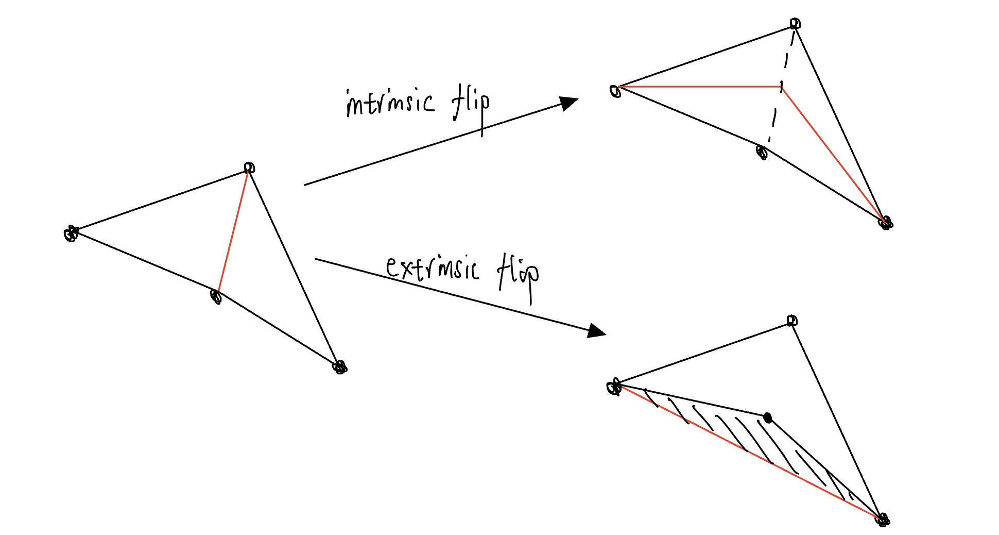
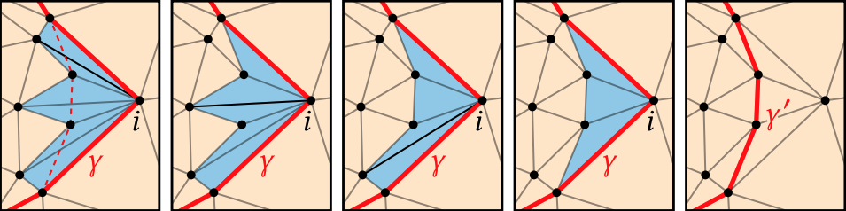
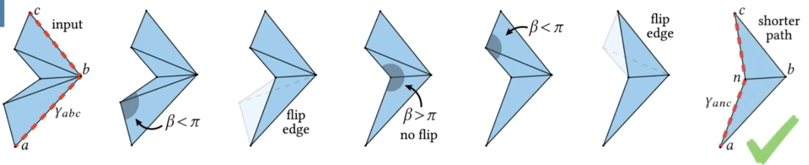
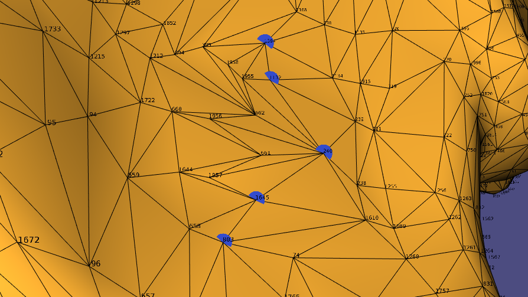
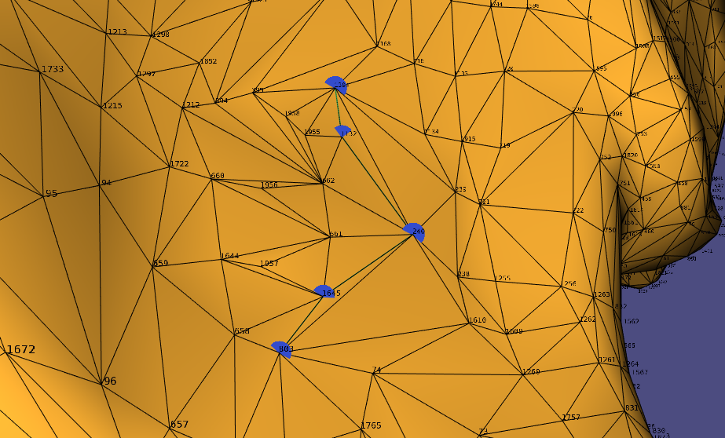

# geodesic-paths
This libigl-style paper implementation provides a "FlipOut" method to find the geodesic paths in triangle meshes using [Eigen](https://eigen.tuxfamily.org/) and [libigl](https://libigl.github.io/)'s built-in solvers.

> Reference paper: [You Can Find Geodesic Paths in Triangle Meshes by Just Flipping Edges](https://www.cs.cmu.edu/~kmcrane/Projects/FlipOut/FlipOut.pdf), by NICHOLAS SHARP and KEENAN CRANE, Carnegie Mellon University


## How this method works

The algorithm takes the input path P (list of ordered vertex), then for each vertex x $\in$ P/{s,t}, we do an extrinsic flip on the set of triangles on the side with the smaller total angle of the path.


#### Extrinsic flip:

When we flip an edge, we mean the extrinsic flip; this flip will create a residual graph as output. By doing the flip, we are reducing the path length because of triangle iequality, which will require removing two triangles from F, then adding 4 triangles to `F` because we are not using the intrinsic format. This operation will only need linear time.



#### Flip Path:

FlipOut shortens a path through three consecutive vertices by pulling it as tight as possible (left, dashed line). To do so, it performs all valid edge flips in the “wedge” of triangles (in blue) incident on the middle vertex i. The curve γ′ along the outside of the wedge (far right) is always shorter.



(from [reference paper](https://www.cs.cmu.edu/~kmcrane/Projects/FlipOut/FlipOut.pdf))

repeatedly flip any flippable edge out of the wedge (namely, any edge contained in a convex pair of triangles), and replace the initial path γ with the path γ′ along the outside of the wedge.


## Key parts during implementation

It's tricky to find which side of the path a,b, and c has a smaller angle since the dot product would only return the smallest angle between the edge ab and bc, but this number doesn't help address the triangles from F. The solution to this problem is to properly define the "left/right side" so we can easily track the set of tangles we are working on.

(from [reference paper](https://www.cs.cmu.edu/~kmcrane/Projects/FlipOut/FlipOut.pdf))

#### Define Left/Right Side:

I use two sets of triangles to define the two sides of an edge by finding all the triangles that contain vertex b, then splitting them into two sets of triangles:

> By convention, the indices in each row of `F` are *ordered* counter-clockwise around the triangle.

- The set of triangles between the triangle has edge ab, and the triangle has edge bc.
- The set of triangles between the triangle has edge cb, and the triangle has edge ba.


#### Find the side with Smaller Angle:

For triangles on Left Side, calculate using dot product the smallest angles on the vertex with b. The angle of the left side of the path (a,b,c) will be the summation of those angles. Comparing the angle of the left and right sides, we can conclude the side of the smaller angle will be the set of the triangle that we will flip.

> The sum angle of two sides could be larger than 2pi since the triangle at two sides of the path (a,b,c) is not necessarily on the same plane.


#### Flip the edge (Extrinsically)

The main difference with the paper is this implementation didn't use intrinsic(edge lengths) triangulations, so we are still using the vertex positions as connectivity for the simplicity of showing the result in the viewer. But the two formats are interchangeable before or after the execution in polynomial time.

Therefore, there are two sets of instructions for editing the F variable for the left and right sides of the path. They both remove the two triangles and add 4 smaller triangles to F; by doing this, the viewer can show the edges that have been newly introduced, and we can do multiple iterations to the path.


## Setup & Demo

Build routine:

```
mkdir build
cd build
cmake ..
make
```

Execution:

```
./geodesicpath [path to mesh.obj(optional)]
```

Libigl viewer:

1. Choose a path by clicking the connected nodes in order.
   - Suggestion: I edit the obj file so you can choose the vertex contains (1132, 240, 1645) to construct the path similar to the example from the flip path section shown above.
   - Example with path: 1394, 1132, 240, 1645, 803
2. Hit [Space] to finalize the path
3. Hit [Space] again to do one iteration
   - Example with path: 1394, 1132, 240, 1645, 803

> Notice that the path (1394, 1132, **240**, 1645, 803) now become (1394, 1132, **662**, **661**, 1645, 803)


##### Course Information:

[CSC2520: a grad-level course in Geometry Processing](https://github.com/alecjacobson/geometry-processing-libigl-implementations)

Instructor: [Prof. Alec Jacobson](https://github.com/alecjacobson)

Final Project: [Geometry Processing – libigl-style implementation final project](https://github.com/alecjacobson/geometry-processing-libigl-implementations)
